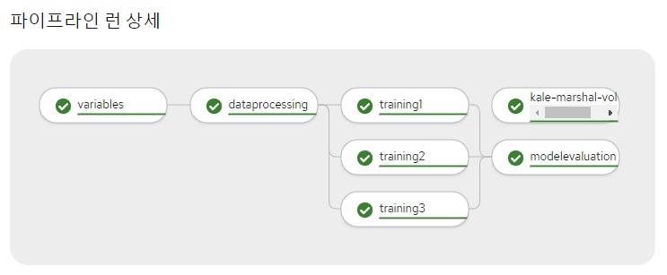

# Kale Distributed Training Guide & Demo Scenario

- `docker.io/tmaxcloudck/kale-tekton-standalone:211222` 이미지로 생성된 kale 노트북에서는 `tf.distribute.experimental.MultiWorkerMirroredStrategy`를 통한 분산 훈련을 지원한다.
- 아래에서 그 사용 방법을 소개한다.

## 1. distributed training을 위한 kale 노트북 생성

- [0.profile.yaml](./yaml/0.profile.yaml), [1.notebook.yaml](./yaml/1.notebook.yaml) 파일을 참고하여 profile과 노트북을 생성한다.
  - 노트북을 재생성하려는 경우, 기존 노트북을 삭제하고 여기에 연결된 pvc도 같이 삭제해주는 것을 권장한다.

## 2. kale 노트북에서 코드 작성 및 kale 설정

- 노트북에 접속하여 [kale-distributed-training-demo.ipynb](./examples/kale-distributed-training-demo.ipynb) 파일을 업로드하거나, 해당 파일을 참고하여 새로운 ipynb 파일을 작성한다.
  - distributed training이 필요한 부분은 별도의 cell로 분리하여 작성한다.
  - 현재 MultiWorkerMirroredStrategy만 지원하며, 해당 strategy를 사용하는 방법은 위 kale-distributed-training-demo.ipynb 파일과 아래 내용을 참고한다.
    - 참고자료
      - TensorFlow Core > Guide > [Distributed training with TensorFlow](https://www.tensorflow.org/guide/distributed_training?hl=ko)
      - TensorFlow Core > Tutorials > [Multi-worker training with Keras](https://www.tensorflow.org/tutorials/distribute/multi_worker_with_keras?hl=ko)
      - TensorFlow Core > API Docs > [tf.distribute.experimental.MultiWorkerMirroredStrategy](https://www.tensorflow.org/api_docs/python/tf/distribute/experimental/MultiWorkerMirroredStrategy?hl=ko)
    - 참고사항
      - worker들을 생성하고 TF_CONFIG를 설정하는 것은 kale에서 pipeline run 생성 시 자동으로 수행된다.
        (아래 \[4. pipeline run 생성 및 결과 확인\]에 첨부된 이미지 참고)
      - 모델 구성과 `model.compile()` 호출은 `strategy.scope()` 안에서 일어나야 한다.
      - 코드에서 batch size를 지정할 때 worker 개수를 고려한다. (`GLOBAL_BATCH_SIZE = BATCH_SIZE * NUM_WORKERS` 이다.)
        - worker 개수는 다음 단계에서 text editor를 통해서 설정하게 된다.
  - kale-distributed-training-demo.ipynb 파일은 [Simple MNIST convnet](https://keras.io/examples/vision/mnist_convnet/)를 참고하여 작성되었다.
  - model 및 tensorflow class들은 pipeline에서 저장 및 전달이 안 되기도 한다.
    따라서, model을 저장할 때는 변수 대신 `model.save`와 `tf.keras.models.load_model`을 사용하는 것을 권장한다.
    - TensorFlow Core > Guide > [Save and load Keras models](https://www.tensorflow.org/guide/keras/save_and_serialize?hl=ko)
    - TensorFlow Core > API Docs > [tf.keras.models.load_model](https://www.tensorflow.org/api_docs/python/tf/keras/models/load_model?hl=ko)
- 코드 작성이 끝나면, 좌측 메뉴에서 kale panel(Kubeflow Pipelines Deployment Panel)을 열고 enable한 후, Pipeline Name, Pipeline Description, Advanced Settings > Docker Image를 설정한다.
  - 이때 docker image로는 해당 kale 노트북과 동일한 image를 사용하는 것을 권장한다.
- kale이 enable된 상태에서 노트북 각 cell의 우측 상단 버튼을 사용하여 type, name, dependency를 설정한다.

## 3. text editor로 ipynb 파일 수정

- 좌측 메뉴에서 탐색기(File Browser)를 열고, 코드 작성 및 kale 설정이 끝난 ipynb 파일을 우클릭하여 Open With > Editor 를 선택하면, json 형식으로 되어있는 파일 정보를 열람하거나 수정할 수 있다.
  - 파일 정보 텍스트 속에는 metadata와 cell들에 대한 정보가 들어있으며, kale을 통해 설정된 정보도 여기에 포함되어 있다.
    - kale panel에서 설정한 내용(name, description, image)은 아래에 저장되어 있다.
      - metadata > kubeflow_노트북 > pipeline_name, pipeline_description, docker_image
    - cell들에 대해 설정한 내용(type, name, dependency)은 아래에 저장되어 있다.
      - cells > metadata > tags
- distributed training이 필요한 cell의 metadata > tags에 "distribute", "workers:n" 태그를 추가한 후 저장한다.
  - "distribute" 태그를 가진 cell은 "workers:n" 태그도 가져야 한다.
  - "workers:n" 태그는 해당 cell에 유일해야 하며, n은 positive integer이어야 한다.
- Editor에서 ipynb 파일을 수정하고 저장한 후, 노트북에서 해당 ipynb 파일을 사용하다 보면 '디스크에서 파일이 변경되었다'는 메세지가 뜰 수 있는데, 이때 "Revert"를 선택하여야 Editor에서 수정한 내용이 유지된다.

## 4. pipeline run 생성 및 결과 확인

- kale panel에서 compile and run을 클릭한다.
- 개발자 console > CI/CD > 파이프라인 런 메뉴에서, 생성된 파이프라인 런의 상세 탭과 로그 탭을 확인한다.
- pipeline name을 바꾸지 않은 채 다시 compile and run을 하려면, 기존에 생성된 pipeline run을 삭제하고 여기에 연결된 pvc까지 같이 삭제해주어야 한다.
- 위의 kale-distributed-training-demo.ipynb 파일을 사용했을 때 생성되는 pipeline run은 아래와 같다.
  

## ※ [kale-tekton-standalone](https://github.com/tmax-cloud/kale-tekton-standalone) 개발 시 주의사항

- docker image build 시 `{project_dir}/docker/jupyterlab/test` 에서 하여야 하며, 이때 `--no-cache` flag를 사용하여야 한다.
- 테스트 시, 기존 노트북에서 kale panel > advanced settings > docker image 만 수정하는 것이 아니라, kale 노트북부터 새로운 이미지로 생성하고 진행하는 것을 권장한다.
