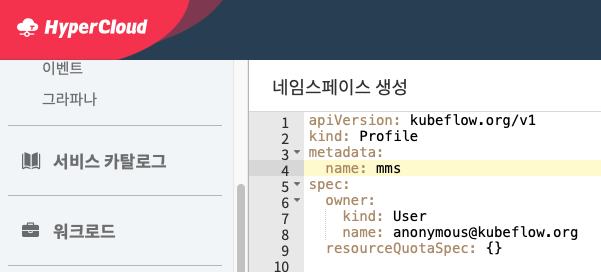

# Kfserving Multi Model Serving 가이드

주의 사항:

- kfserving 0.5 버전 이상 필요
- 0.5 버전 기준 Multi-Model InferenceService의 `agent`에서 s3, gs 프로토콜만을 지원하여 minio storage server 사용 (pvc 지원하지 않음)
    - 본 시나리오에서는 kubeflow에서 사용중인 minio storage server를 이용함
- 본 시나리오는 [auto-generated model configration](https://github.com/triton-inference-server/server/blob/master/docs/model_configuration.md#auto-generated-model-configuration)을 지원하는 TensorFlow saved-model을 사용함
    - 다른 framework도 지원하지만 TensorFlow saved-model은 자동으로 세팅을
    지원해준다고 함

# 가이드 요약

ML model들을 작성하고 하나의 ML server에서 model들을 추론할 수 있는 **Multi-Model Serving**이 가능한 ML service를 만든다.


## 구체적인 순서

0. 작업을 위한 namespace, pvc 만들기
1. ML 코드 작성을 위한 notebook 만들기
2. ML model을 코딩하고, InferenceService에서 사용할 checkpoint 생성하기
3. InferenceService에서 model을 로딩할 수 있도록 minio 세팅하고 InferenceService 생성하기
4. 학습한 model들을 InferenceService에 로딩하기
5. 학습한 model들을 이용한 inference 테스트


# Step 0. 작업을 위한 namespace, pvc 만들기

- master node에서 hyperflow 기능 사용을 위한 작업을 위한 profile (namespace) 생성



```bash
kubectl apply -f profile.yaml
```

- 본 가이드의 작업을 위해 model-pvc(readWriteMany)를 생성


# Step 1. ML 코드 작성을 위한 notebook 만들기

- hyperflow에서 ML 코드 작성을 위한 JupyerNotebook 생성

- 이전 단계에서 생성한 model-pvc를 마운트하는 model-notebook을 생성

~~사진~~

- 참고: [model-notebook.yaml](model-notebook.yaml)

- 본 가이드에서는 TensorFlow만을 사용하여 TensorFlow를 지원하는 JupyterNotebook를 사용함

- 배포가 정상적으로 되었으면 action->connect를 눌러 jupyter 진입


# Step 2. ML model을 코딩하고, InferenceService에서 사용할 checkpoint 생성하기

- TensorFlow를 활용하여 ML 코드를 작성하고 학습을 진행

- 학습한 model의 checkpoint를 저장함

- [tf-fashion.ipynb](tf-fashion.ipynb)와 [tf-mnist.ipynb](tf-mnist.ipynb)를 참고하여 model 코드 작성하고 학습을 진행함

- 본 시나리오는 Triton에서auto-generated model configuration을 지원하는  

- 학습한 모델을 checkpoint API를 통해서 저장함

~~사진 추가


# Step 3. InferenceService에서 model을 로딩할 수 있도록 minio 세팅하고 InferenceService 생성하기

## S3 protocol 지원을 위한 minio storage server 설정

- 현재 kfserving의 `agent`에서는 `StorageUri`로 `gs:`, `s3:` 프로토콜만을 지원하여 S3 호환성를 가진 minio storage server를 사용하여 진행

- 본 가이드에서는 kubeflow에서 사용하는 mino storage server를 이용하여 진행

- kubeflow에서 사용하는 minio storage server의 `MINIO_SECRET_KEY`와 `MINIO_ACCESS_KEY` 확인

```bash
kubectl get pods -l app=minio -o jsonpath={.items[0].spec.containers[0].env} -n kubeflow

[{"name":"MINIO_ACCESS_KEY","value":"minio"},{"name":"MINIO_SECRET_KEY","value":"minio123"}]
```

- minio service 확인

```bash
kubectl get svc -l app=minio -o name -n kubeflow | cut -d "/" -f 2

minio-service
```

- InferenceService의 `agent`에서 minio의 s3 endpoint에 접근할 수 있도록 설정
    - 만약 이전 단계에서의 minio의 `MINIO_ACCESS_KEY` 또는 `MINIO_SECRET_KEY`가 다른 경우 변경해서 적용

```bash
kubectl apply -f s3_secret.yaml
```


- 본 가이드에서는 mms라는 namespace에서 진행하기 때문에 kubeflow namespace의 minio-service와 연결이 필요

    - 방법 1) service DNS의 full name을 `s3_secret`에 작성 후 secret 생성

```bash
kubectl apply -f s3_secret.yaml
```


    - 방법 2) `ExternalName`를 통해 kubeflow namespace에 존재하는 minoi-service 연결

```bash
kubectl apply -f external_service.yaml
kubectl apply -f s3_secret.yaml
```


## InferenceService 생성하기

- Multi Model Serving을 위한 InferenceService (inferenceserver) 생성
    - 기존의 InferenceService와 다르게 `StorageUri`를 제외하고 생성
    - s3 endpoint를 위한 serviceaccount 연결

```bash
kubectl apply -f multi_model_triton_server.yaml
```


- InferenceService가 정상적으로 생성 되었는지 확인
    - 아래의 결과처럼 `READY`가 True이면 정상

```bash
kubectl get inferenceservice triton-mms -n mms

NAME   URL                                                    READY   AGE
triton-mms   http://triton-mms.default.35.229.120.99.xip.io   True    8h
```


# Step 4. 학습한 model들을 InferenceService에 로딩하기

## minio client를 통한 minio storage server로 업로드

- 이전 단계에서 만든 checkpoint를InferenceService에서 로딩할 수 있게하려면 minio
storage server로 업로드를 해야함

- minio client를 통해서 checkpoint를 업로드

- minio client를 사용하기 위해 JupyterNoteBook에서 터미널을 열어 다음 명령어를 입력

```bash
wget https://dl.min.io/client/mc/release/linux-amd64/mc
chmod +x mc
```

- minio storage server 접근을 위해 minio pod IP와 port를 알아야함

- master node에서 다음 명령어 입력

```
# IP
kubectl get pod -l app=minio -n kubeflow -o jsonpath='{.items[0].status.podIP}'
# Port
kubectl get pod -l app=minio -n kubeflow -o jsonpath='{.items[0].spec.containers[0].ports[0].containerPort}'
```

- minio client 다운로드 받은 경로에서 위의 명령어에서 출력된 IP, port를 사용하여 kubeflow의 minio server 접근
    - access key와 secret key는 이전 단계에서 확인 했던 것을 사용

```bash
./mc config host add myminio http://${MINIO_IP}:${MINIO_PORT} ${MINIO_ACCESS_KEY} ${MINIO_SECRET_KRY}
```

- 해당 minio server에서 bucket을 만들고 checkpoint 업로드

```bash
# bucket 생성
./mc mb myminio/triton
# 업로드
./mc cp -r models/ myminio/triton/models
```

- 제대로 업로드 되었는지 확인

~~사진~~

```bash
./mc tree myminio/
```

- 만든 model을 통한 inference service를 제공할 TrainedModel 생성
    - [fashion-model.yaml](fashion-model.yaml), [mnist-model.yaml](mnist-model.yaml) 참고

~~사진~~

```bash
kubectl apply -f fashion-model.yaml
kubectl apply -f mnist-model.yaml
```

- Agent에서 정상적으로 모델을 다운로드하였는지  확인

```bash
SERVER=$(k get pod -l serving.kubeflow.org/inferenceservice=triton-mms -o name -n mms)
kubectl -n mms logs $SERVER agent

~~로그 추가 로그 추가~~
~~로그 추가 로그 추가~~
~~로그 추가 로그 추가~~
~~로그 추가 로그 추가~~
~~로그 추가 로그 추가~~
```

- InferenceService에서도 memory에 로드했는지 확인 (master node에서 확인)

```bash
kubectl logs $SERVER kfserving-container

~~로그 추가 로그 추가~~
~~로그 추가 로그 추가~~
~~로그 추가 로그 추가~~
~~로그 추가 로그 추가~~
~~로그 추가 로그 추가~~
~~로그 추가 로그 추가~~
```


# Step 5. 학습한 model들을 이용한 inference 테스트

- InferenceService로 request를 위한 환경 변수 설정 (master node에서 진행)

```bash
# INGRESS에서 인식할 수 있도록 SERVICE_HOSTNAME 설정
SERVICE_HOSTNAME=$(kubectl get inferenceservices triton-mms -o jsonpath='{.status.url}' -n mms | cut -d "/" -f 3)
CLUSTER_IP=$(kubectl -n istio-system get service kfserving-ingressgateway -o jsonpath='{.status.loadBalancer.ingress[0].ip}')
```

- Request가 정상적으로 가는지 확인
    - 정상적으로 가지 않거나 다음과 같이 서버의 metadata가 나오지 않는다면 InferenceService pod의 `ClusterIP` 또는  service를 통해서 expose해서 해당 url을 사용해야함 (endpoint는 동일)

```bash
curl -v -H "Host: ${SERVICE_HOSTNAME}" http://${CLUSTER_IP}/v2

{"name":"triton","version":"2.2.0","extensions":["classification","sequence","model_repository","schedule_policy","model_configuration","system_shared_memory","cuda_shared_memory","binary_tensor_data","statistics"]}
```


- 모델 endpoint로 prediction 요청

```bash
MODEL_NAME=cifar10

curl -v -X POST -H "Host: ${SERVICE_HOSTNAME}" http://${CLUSTER_IP}/v2/models/$MODEL_NAME/infer -d @./${MODEL_NAME}.json

{"model_name":"cifar10","model_version":"1","outputs":[{"name":"OUTPUT__0","datatype":"FP32","shape":[1,10],"data":[-2.0964813232421877,-0.1370079517364502,-0.509565532207489,2.795621395111084,-0.560547947883606,1.9934228658676148,1.1288189888000489,-1.4043134450912476,0.6004878282546997,-2.123708486557007]}]}
```

- 이 과정까지 마쳤으면 Multi Model Serving이 된 것이다.
